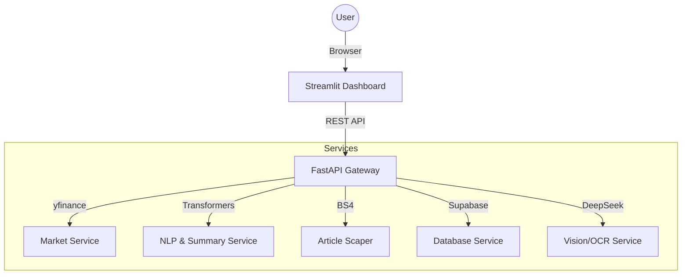

# AInvest Terminal

AInvest Terminal is an automated equity research platform designed to democratize access to institutional-grade stock analysis. By combining technical, social, and fundamental signals into a single "Investment Memo," it provides investors with data-backed summaries and algorithmically generated recommendations.

## Overview

The platform follow a micro-service inspired architecture, utilizing a robust FastAPI backend to serve distinct modules for Market Data, NLP Sentiment, Social Signals, Vision-based OCR, and Portfolio Tracking. All data is visualized through a premium, glassmorphism-themed Streamlit dashboard.

## Key Features

- **Real-time Market Data**: Live price tracking and technical indicators (RSI, MACD, SMA) powered by `yfinance`.
- **AI-Powered Sentiment**: News headline analysis using optimized `FinBERT` models to gauge market mood.
- **Advanced NLP Summarization**: Full article scraping and summarization to distill long-form news into actionable insights.
- **Social Signal Aggregation**: Integration with Stocktwits and Reddit to capture community sentiment and bullish/bearish trends.
- **Investment Recommendation Engine**: A proprietary scoring algorithm that synthesizes multiple data points into BUY, SELL, or HOLD signals.
- **Document Intelligence (Vision)**: OCR processing of PDF financial reports via `DeepSeek` or `Tesseract` for structured data extraction.
- **Portfolio Tracking**: Real-time virtual trade monitoring with performance metrics and P/L visualization.

## Tech Stack

- **Backend**: Python, FastAPI, Uvicorn
- **Frontend**: Streamlit, Plotly (Data Viz)
- **Deep Learning**: PyTorch, Transformers (FinBERT, DistilBART)
- **Data & Scraping**: YFinance, BeautifulSoup4, Pandas
- **Database**: Supabase (via Supabase Python Client)
- **OCR**: DeepSeek API / Tesseract

## Getting Started

### Prerequisites

- Python 3.10 or higher
- [Tesseract OCR](https://github.com/tesseract-ocr/tesseract) (optional, for local document analysis)

### Installation

1. **Clone the repository**:
   ```bash
   git clone <repository-url>
   cd Banking
   ```

2. **Install dependencies**:
   ```bash
   pip install -r requirements.txt
   ```

3. **Environment Setup**:
   Copy `.env.example` to `.env` and fill in your credentials (Supabase, DeepSeek, etc.).
   ```bash
   cp .env.example .env
   ```

## Running the Application

The project includes a convenient runner script to start both the backend and frontend simultaneously:

```bash
python run_app.py
```

Alternatively, you can start them manually:

- **Backend**: `python -m uvicorn app.main:app --reload` (Port 8000)
- **Frontend**: `python -m streamlit run frontend/app.py` (Port 8501)

## Architecture



For detailed architecture decisions, see [architect.md](docs/architect.md).

## Project Structure

- `app/`: Core FastAPI application and logic.
  - `api/`: Endpoint routers.
  - `services/`: Specialized business logic modules.
- `frontend/`: Streamlit dashboard implementation.
- `docs/`: Product requirements, technical specs, and architecture logs.
- `tests/`: Comprehensive test suite for all services.
- `data/`: Local storage for cached or temporary data.

## Testing

The project maintains high test coverage across all critical services.

```bash
python -m pytest
```

---
